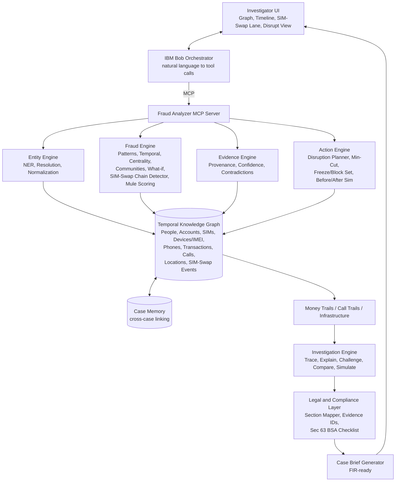

# Architecture

## Diagram



## ASCII overview

```
INVESTIGATOR UI <-> BOB ORCHESTRATOR --(MCP)--> [Entity | Fraud | Evidence | Action] engines
                                                      |
                                        TEMPORAL KNOWLEDGE GRAPH <-> Case Memory
                                                      |
                              Money / Call trails / Infrastructure
                                                      |
                                           INVESTIGATION ENGINE
                                                      |
                                        LEGAL & COMPLIANCE LAYER
                                                      |
                                          CASE BRIEF GENERATOR
```

## Components
| Component | Technology (planned) | Responsibility |
|---|---|---|
| Bob Orchestrator | IBM Bob (CLI/IDE) with MCP | Interprets requests, plans and chains tool calls, narrates results, drafts brief prose |
| MCP Server | Python (MCP SDK) | Exposes engines as typed tools to Bob |
| Entity Engine | Python, Bob-assisted extraction, rapidfuzz, indic-transliteration | NER over English/Hinglish/Devanagari, entity resolution, normalization |
| Fraud Engine | NetworkX, rule-based detectors | Pattern typing, centrality, communities, SIM-Swap detection, mule scoring, what-if |
| Evidence Engine | Python | Provenance, confidence scores, contradiction detection |
| Action Engine | NetworkX (betweenness, min-cut) | Freeze/block set, before/after simulation |
| Temporal Knowledge Graph | NetworkX + JSON/SQLite persistence | Typed nodes, timestamped edges, source IDs |
| Case Memory | SQLite | Cross-case "seen before" matching and graph merge |
| Investigation Engine | Python | Trace, explain, challenge, compare, simulate |
| Legal Layer | Lookup table + Bob phrasing | Finding to section mapping, BSA Sec 63 checklist |
| Brief Generator | Jinja2 + Markdown to PDF | FIR-ready brief |
| UI | React + Cytoscape.js + timeline lanes | Graph, timeline, SIM-swap lane, disrupt before/after, Bob chat |

## Where Bob is load-bearing
- **Every user action routes through Bob**: chat, "Disrupt", "Generate brief" all become Bob tool calls.
- **Extraction**: Bob parses unstructured/Hinglish text into entities and relations, returned to the Entity Engine as structured JSON.
- **Planning**: Bob chains tools (extract -> resolve -> detect -> disrupt -> brief) and explains why.
- **Challenge mode**: Bob argues against the top kingpin hypothesis using the Evidence Engine and lists evidence that would change the ranking.
- **Writing**: Bob drafts the narrative sections of the brief from graph facts; numbers and IDs come from deterministic engines.

## Bob tool surface (MCP)
| Tool | Purpose |
|---|---|
| `ingest_evidence(files, case_id)` | Register raw evidence, return evidence IDs |
| `extract_entities(evidence_id)` | Structured entities and relations |
| `resolve_entities(case_id)` | Merge name/phone/account variants |
| `detect_pattern(case_id)` | Fraud pattern type and confidence |
| `detect_simswap_chains(case_id, window_hours)` | SIM-swap events and timelines |
| `score_mules(case_id)` | Mule likelihood with reasons |
| `rank_hierarchy(case_id)` | Kingpin/mule/victim tiers with confidence |
| `plan_disruption(case_id, budget)` | Min-cut freeze/block set and capacity reduction |
| `challenge(case_id, hypothesis)` | Counter-evidence and sensitivity |
| `link_prior_cases(case_id)` | Case Memory matches |
| `map_legal(case_id)` | Candidate sections, evidence IDs, BSA checklist |
| `generate_brief(case_id)` | FIR-ready brief |

## End-to-end data flow
1. Investigator uploads evidence; Bob calls `ingest_evidence` and `extract_entities`.
2. Entity Engine resolves variants and writes nodes/edges (with timestamps, source IDs) to the graph.
3. Fraud Engine detects pattern, SIM-swap chains, mule scores, communities.
4. Action Engine computes the freeze/block set and simulated capacity reduction.
5. Investigation Engine assembles traces and hypotheses; Evidence Engine attaches confidence and contradictions.
6. Legal Layer maps sections and the BSA checklist.
7. Brief Generator produces the FIR-ready document shown in the UI.

## Security and scalability notes
- Mock data only; no real PII in the repo. `.env` is never committed.
- Every output carries evidence IDs for auditability.
- Legal output is advisory; a legal officer verifies.
- Graph algorithms scale to tens of thousands of nodes in-memory; a graph DB (e.g. Neo4j) is the production path.
- Production would need access control, audit logs and data-retention policy for sensitive case data.
